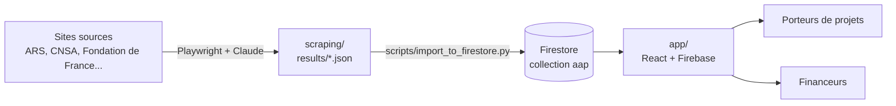

# AAP Santé — Contexte projet pour Claude Code

Fichier chargé automatiquement à chaque session Claude Code. Il remplace les anciens contextes
dispersés (CLAUDE.md du dossier scraping, PROJET-RESUME.md de l'application web),
fusionnés le 2026-10-09 dans ce dépôt unique.

---

## Qui / Quoi

- **Porteur** : Monsieur Pierre-Yves DUCOUT, fondateur de **ARCADIA SASU** (Évry, 91).
- **Projet** : **AAP Santé** — plateforme B2B SaaS d'agrégation et de matching IA d'appels à projets
  du secteur santé / médico-social français.
- **Cibles** : ~18 000 établissements (MCO, SSR, EHPAD, SSIAD, HAD, IME, ESAT…) côté porteurs ;
  financeurs publics/privés (ARS, CNSA, fondations, collectivités) côté AAP.
- **Phase actuelle** : reprise du projet (octobre 2026) — objectif : **obtenir une démo testable de bout en bout**
  (AAP scrapés visibles dans l'application).
- **Développement** : en solo par Monsieur DUCOUT dans Claude Code. Niveau : Python basique, pas expert.
  Toujours expliquer le POURQUOI avant le COMMENT.

---

## Style de réponse attendu

- **Français**, registre professionnel neutre.
- Nommer **« Monsieur DUCOUT »** et **« ARCADIA SASU »** dans les documents livrables.
- **Justifier chaque choix technique.**
- **Épistémie honnête** : si on ne sait pas, le dire. Marquer `[À VALIDER — Monsieur DUCOUT]` plutôt qu'inventer.
- **Pas d'emojis** dans les fichiers produits (code, .md, .txt). OK dans la conversation.
- Diagrammes **Mermaid** pour l'architecture et les flux.
- Références **RGPD** explicites quand pertinent (DPO = M. DUCOUT, AIPD reportée post-MVP).

---

## Architecture du dépôt (un seul endroit pour tout)

```
AAP/
├─ CLAUDE.md            <- ce fichier
├─ README.md            <- démarrage rapide (appli + scraping + import)
├─ docs/                <- cahiers des charges, comparatifs, anciens résumés (référence, pas de code)
├─ app/                 <- APPLICATION WEB : React 18 + TypeScript + Vite + Tailwind + Firebase
├─ scraping/            <- COLLECTE DES AAP : Python 3.12 + Playwright + Claude API (tool use)
├─ scripts/             <- JONCTION : import des JSON scrapés vers Firestore
└─ _archive/            <- prototypes abandonnés (crawl4ai, HTTrack). Ne pas réutiliser.
```



---

## DÉCISION DE STACK (2026-10-09) — à respecter

| Volet | Stack retenue | Pourquoi |
|---|---|---|
| Application web | **React 18 + Firebase (Auth, Firestore, Storage, Functions)** — dossier `app/` | Fonctionnelle, 8 phases du CDC réalisées, déjà déployée en test. C'est la voie la plus rapide vers une démo. |
| Scraping | **Python + Playwright + Claude API** — dossier `scraping/` | POC validé : 5 sources, ~105 AAP, ~0,03 €/AAP. |
| Jonction | **Script Python `firebase-admin`** — `scripts/` | Le plus simple pour alimenter Firestore depuis les JSON du scraping. |

**MISE EN PAUSE** : la cible FastAPI + PostgreSQL + Next.js décrite dans `docs/CDC_AAP_Sante_v1_2026-04.md`
(section stack) n'est **pas** la stack active. Ne pas la commencer sans décision explicite de Monsieur DUCOUT.
Le CDC v1 reste la référence **fonctionnelle** (schéma `AapNormalized`, principes de scraping, RGPD).

**ARCHIVÉ** : le prototype React 19 / Vite 7 / Tailwind v4 (service export CSV/Excel/PDF, 115 tests)
est conservé dans le tag Git `archive/export-v0` (ex-branche `claude/test-monitoring-code-5THZo`).
Son module `src/services/export.ts` pourra être porté dans `app/` quand l'export sera utile.

---

## Volet application web (`app/`)

- Projet Firebase : `aapi-11bc3` `[À VALIDER — Monsieur DUCOUT : projet toujours actif ?]`
- Déploiement de test : Netlify `https://teal-twilight-a7fcf3.netlify.app/` `[À VALIDER — encore en ligne ?]`
- Commandes : `cd app && npm install && npm run dev` (port 3000), `npm run build`, `npm run lint`
- Variables : `app/.env` (copier `app/.env.example`), jamais commité.
- Rôles : `porteur`, `financeur`, `admin` (champ `users/{uid}.userType`).
- Abonnement : essai 14 jours à l'inscription ; Stripe **non branché** (Cloud Functions non déployées).
- Détail complet (routes, collections Firestore, limites connues) : `docs/resume_application_web_2026-10.md`.

Contraintes UI fréquentes (source d'erreurs TypeScript) :
- `Button` : `variant` ∈ `primary | secondary | danger | ghost`
- `Badge` : `variant` ∈ `primary | success | warning | error | gray`
- `Stepper` : étapes `{ label, description }`

---

## Volet scraping (`scraping/`)

Principes non négociables (hérités du CDC v1 et validés par le POC) :
1. **Schéma unique `AapNormalized`** (`scraping/schema.py`) : toute source produit le même format.
2. **Claude tool use pour l'extraction** — pas de parser HTML par site.
3. **Signature de dédoublonnage** = `sha1(titre|financeur|date_cloture)[:16]`.
4. **Delta scraping** (cache inter-runs) pour contenir le coût API.
5. **Auto-healing IA** : l'IA propose un patch, un humain valide. Jamais de mise en prod automatique.
6. **Prompt caching** sur le system prompt ; **retry** sur 429/529/5xx.
7. **4 outils séparés** : `run.py` (JSON), `validate.py` (HTML), `analyze_costs.py` (texte), `debug_page.py` (navigateur visible). Ne pas les fusionner.

Conventions :
- 1 source = 1 fichier `scraping/sources/<nom>.py`, ~150 lignes max, deux fonctions obligatoires
  `async def list_aaps(page)` et `async def fetch_detail(page, url, downloads_dir)`.
- Modèle Anthropic : `claude-sonnet-4-6` (ne pas changer sans demande explicite).
- `load_dotenv(override=True)` dans `run.py` (fix Windows).
- **Règle d'ajout d'une source** : `python run.py --source <nom>` puis `python validate.py --source <nom>`,
  ouvrir le rapport HTML, et ne déclarer la source opérationnelle qu'après contrôle visuel.

Sources opérationnelles : `fondation_de_france` (64 AAP), `ars_idf` (18), `ars_idf_local` (18), `cnsa` (3), `ars_corse` (2).
**Registre des sources** : `scraping/sources/registre.json` (334 émetteurs, statut par source), outil
`scraping/registre.py`, vue `scraping/REGISTRE_SOURCES.md`. Toute nouvelle source part du registre.

---

## Volet jonction (`scripts/`)

- `scripts/import_to_firestore.py` : lit `scraping/results/*.json`, mappe `AapNormalized` vers le type `AAP`
  de l'application (`app/src/types/index.ts`), écrit dans la collection Firestore `aap` avec `source: "scraped"`.
- Identifiant du document = signature de dédoublonnage (ré-import idempotent).
- Nécessite une clé de compte de service Firebase (`scripts/serviceAccountKey.json`, **jamais commitée**).
- Environnement Python : `.venv` à la racine du dépôt (`scripts/requirements.txt`, `grpcio` fixé en 1.74.0 à cause
  de Smart App Control). `firebase-tools` installé en global pour déployer règles et index.

---

## État d'avancement (à maintenir à jour)

| Brique | État | Commentaire |
|---|---|---|
| Fusion en un dépôt unique | OK | 2026-10-09 |
| Appli web : phases 1 à 8 du CDC | OK | auth, profils, AAP, candidature, évaluation, messagerie, admin |
| Appli web : Cloud Functions | A FAIRE | écrites dans `app/functions/`, non déployées |
| Appli web : Stripe | A FAIRE | Price IDs à remplacer, functions à déployer |
| Appli web : tests | A FAIRE | aucun test |
| Appli web : pages placeholder | A FAIRE | édition AAP, profil, pages légales, mot de passe oublié |
| Scraping : 5 sources | OK | voir ci-dessus |
| Scraping : registre des sources | OK | 2026-10-09 : 334 sources, 304 pages vérifiées |
| Scraping : connecteur générique ARS (18 ARS) | A FAIRE | prochain changement ; collecte gratuite, extraction sur une ARS d'abord |
| Scraping : autres sources du registre | A FAIRE | une source ou famille par changement, dans l'ordre du registre |
| Jonction scraping -> Firestore | OK | 2026-10-09 : 89 AAP importés dans `aapi-11bc3` (doublons fusionnés, import rejouable) |
| Démo bout en bout testable | OK | 2026-10-09 : AAP scrapés visibles dans « Rechercher des AAP », procédure README section 4 |
| Pièces jointes des AAP scrapés | OK (local) | 2026-10-09 : servies depuis le PC en dev (`app/public/documents`) ; Storage codé, inactif (forfait Blaze refusé pour l'instant) |
| Méthode OpenSpec installée | OK | 2026-10-09 — 8 workflows, config projet |

---

## Ce qu'il NE faut PAS faire sans validation explicite

- Changer le schéma `AapNormalized` (impact toutes les sources) ou le type `AAP` de l'appli.
- Démarrer la stack FastAPI/PostgreSQL/Next.js (mise en pause).
- Installer une lib lourde (ex : Crawl4AI — rejetée, voir `docs/comparatif_scraping_2026-04.md`).
- Proposer un modèle IA local pour le MVP (décision : Claude API jusqu'à > 500 €/mois).
- Modifier un cahier des charges dans `docs/` sans en informer explicitement.
- Committer une clé (Anthropic, Firebase, Stripe). Tout est dans des `.env` ignorés par Git.
- Supprimer la branche ou le tag d'archive.

---

## Méthode de développement : OpenSpec (spec-driven) — depuis 2026-10-09

Toute nouvelle fonctionnalité passe par un **changement OpenSpec** avant d'écrire du code.
Pourquoi : les sessions précédentes produisaient du code déclaré « fonctionnel » sans critère
vérifiable par Monsieur DUCOUT. Les scénarios WHEN / THEN de la spec sont ce critère.

Cycle (commandes slash dans Claude Code) :

| Commande | Effet |
|---|---|
| `/opsx:explore` | Comprendre le problème et le code existant, sans rien écrire |
| `/opsx:propose "<idée>"` | Crée `openspec/changes/<nom>/` : `proposal.md`, `specs/`, `design.md`, `tasks.md` |
| `/opsx:apply` | Implémente les tâches, une par une |
| `/opsx:verify` | Rejoue chaque scénario WHEN / THEN : OK ou ÉCHEC |
| `/opsx:archive` | Range le changement dans `changes/archive/` et fusionne dans `openspec/specs/` |

- `openspec/specs/` = la vérité fonctionnelle du produit (remplace progressivement les CDC de `docs/`,
  qui restent la référence historique).
- Règles d'écriture des artefacts : `openspec/config.yaml` (français, pas d'emojis, coût estimé, etc.).
- Prérequis : CLI `openspec` installé sur le poste (`npm install -g @fission-ai/openspec@latest`, Node >= 20.19).
- Changements archivés : `demo-aap-scrapes-visibles`, `pieces-jointes-aap` (2026-10-09). Specs en vigueur :
  `import-aap-scrapes`, `consultation-aap-scrapes`.
- Décision de Monsieur DUCOUT (2026-10-09) : tout tester en local avant de déployer ; pas de forfait Blaze
  (facturation) pour l'instant.

---

## Outillage Claude Code

- Hooks utilisateur (`.claude/settings.json`) : `session_start.py` (contexte au démarrage) et
  `detect_session_end.py` (déclenche le skill code-tracker). Fichiers dans `C:/Users/pierr/.claude/hooks/`.
  `[À VALIDER — session_start.py pointe-t-il encore vers le bon dossier après le déménagement ?]`
- Skill `code-tracker` : bilan de fin de session, CHANGELOG, commits.
- Comptes rendus de session : `.claude/sessions/` (local, non versionné).

---

## Références externes

- Dépôt : https://github.com/ducoutpy-lgtm/AAP
- Console Anthropic : https://console.anthropic.com/
- Console Firebase : https://console.firebase.google.com/project/aapi-11bc3
- Fondation de France (source POC) : https://www.fondationdefrance.org/fr/appels-a-projets
