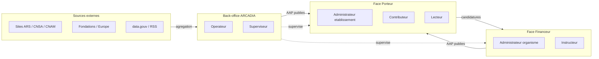
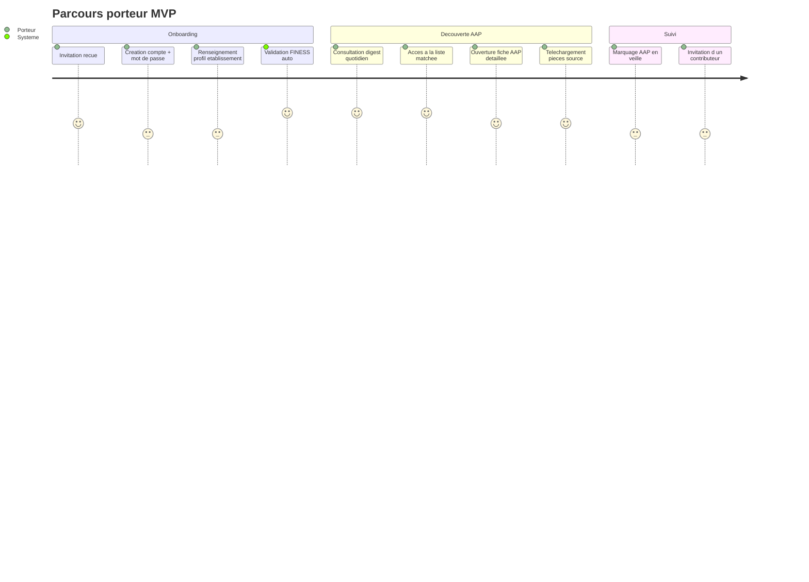
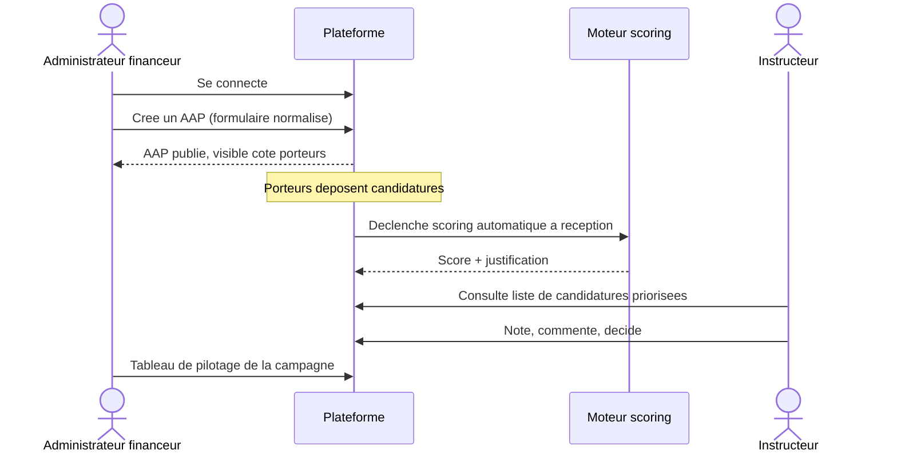
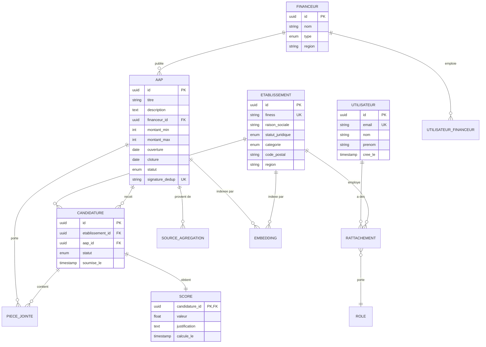
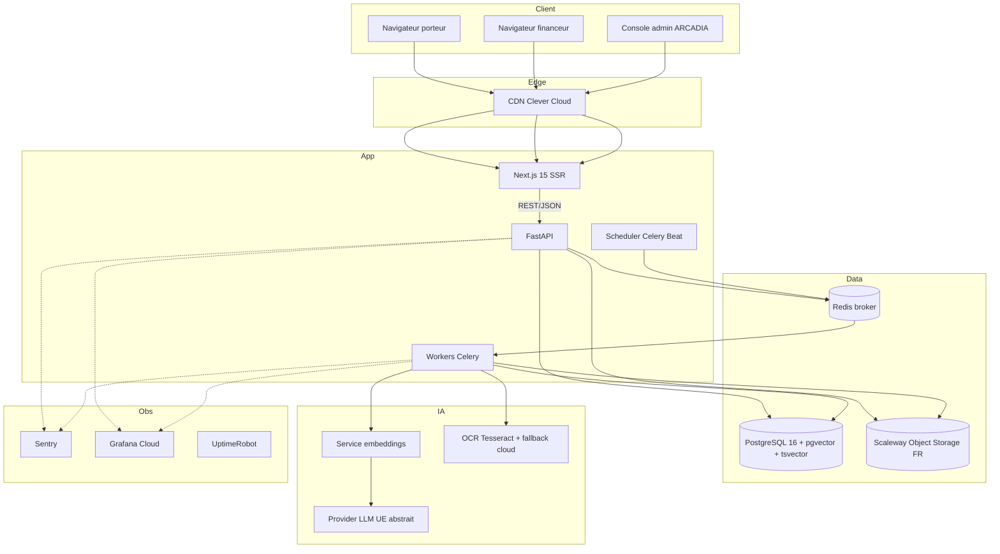
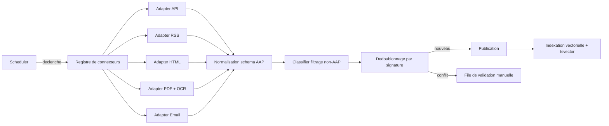

# CAHIER DES CHARGES — AAP SANTÉ

**Plateforme SaaS B2B d'agrégation et de matching IA d'appels à projets sanitaires et médico-sociaux**

---

| Champ | Valeur |
|---|---|
| Document | CDC_AAP_Sante_v1.md |
| Version | 1.0 |
| Date d'émission | 2026-04-21 |
| Maître d'ouvrage | ARCADIA SASU — Evry (91) |
| Représentant légal | Monsieur Pierre-Yves DUCOUT, fondateur-dirigeant |
| Maître d'œuvre MVP | Monsieur DUCOUT, assisté de Claude Code (développement agentic) |
| Phase projet | Pré-MVP — candidature IMT Starter 2026 — dotation cible T2 2026 |
| DPO désigné | Monsieur Pierre-Yves DUCOUT |
| Classification | Interne — destiné à études de faisabilité, jury d'incubateur, investisseurs Seed |

---

## Sommaire

0. [Page de garde — ci-dessus](#)
1. [Contexte et vision](#1-contexte-et-vision)
2. [Périmètre fonctionnel (MVP / v2 / vision 2031)](#2-périmètre-fonctionnel)
3. [Acteurs et parcours utilisateurs](#3-acteurs-et-parcours-utilisateurs)
4. [Spécifications fonctionnelles détaillées par module](#4-spécifications-fonctionnelles-détaillées)
5. [Modèle de données](#5-modèle-de-données)
6. [Architecture technique](#6-architecture-technique)
7. [Moteur d'agrégation des AAP](#7-moteur-dagrégation-des-aap)
8. [Moteur IA de matching](#8-moteur-ia-de-matching)
9. [Sécurité et RGPD](#9-sécurité-et-rgpd)
10. [Infrastructure, hébergement, observabilité](#10-infrastructure-hébergement-observabilité)
11. [Design system et direction visuelle](#11-design-system-et-direction-visuelle)
12. [Maquettes et wireframes](#12-maquettes-wireframes)
13. [Roadmap par jalons](#13-roadmap-par-jalons)
14. [Matrice des risques techniques](#14-matrice-des-risques-techniques)
15. [Critères d'acceptance et stratégie de tests](#15-critères-dacceptance-et-tests)
16. [Annexes — glossaire, hypothèses, points à valider](#16-annexes)

---

## 1. Contexte et vision

### 1.1 Le besoin marché

Le secteur sanitaire et médico-social français compte environ **18 000 établissements** (MCO, SSR, EHPAD, SSIAD, HAD, IME, etc.) qui accèdent à des financements complémentaires via des appels à projets (AAP) émis par une cinquantaine d'organismes institutionnels : ARS régionales, CNSA, CNAM, fondations privées, programmes européens, conseils départementaux, mairies. L'information est **fragmentée**, **hétérogène** (HTML, PDF, newsletters, bulletins administratifs) et **chronophage** à surveiller pour les directions d'établissement, dont ce n'est pas le métier principal.

Côté financeurs, la collecte, l'instruction et l'analyse des candidatures reposent majoritairement sur des processus artisanaux (formulaires PDF, e-mails, tableurs), qui limitent la qualité du ciblage et l'efficacité de l'allocation des enveloppes.

### 1.2 La proposition de valeur d'AAP Santé

AAP Santé est une plateforme SaaS B2B **double-face** :

- **Face Porteur** — agrégation automatisée de l'intégralité des AAP pertinents pour le secteur, matching personnalisé selon le profil de l'établissement, suivi des candidatures.
- **Face Financeur** — publication normalisée des AAP, réception structurée des candidatures, scoring IA pour pré-qualification, tableau de pilotage des campagnes.

### 1.3 Vision 2031

À horizon 5 ans, ARCADIA SASU se positionne comme **observatoire du financement de la santé en France** et envisage l'extension de la plateforme à d'autres secteurs publics (collectivités territoriales, mairies), dont la logique de financement par appel à projets est analogue.

### 1.4 Trajectoire

| Jalon | Objectif |
|---|---|
| Pré-MVP (phase actuelle) | Validation du concept, rédaction CDC, candidature IMT Starter 2026 |
| MVP — Jalon 1 | Moteur de scraping opérationnel (≥ 5 sources, ≥ 50 AAP) — livrable IMT Starter |
| MVP — Jalon 2 | Plateforme double-face avec pilote (5 établissements + 2 financeurs) |
| v1 commerciale | Ouverture self-service porteurs avec validation FINESS |
| v2 | SSO AgentConnect, consortium, API financeurs |
| Vision 2031 | Observatoire + extension secteur collectivités |

### 1.5 Contraintes transverses

- **RGPD strict** — aucune donnée de santé nominative n'est traitée. La plateforme manipule uniquement des AAP publics et des profils d'établissements et de candidatures (données professionnelles).
- **Souveraineté** — hébergement France, sous-traitants UE privilégiés.
- **Crédibilité institutionnelle** — design et vocabulaire compatibles avec les codes du service public.

---

## 2. Périmètre fonctionnel

### 2.1 Matrice de priorisation

| Fonction | MVP | v2 | Vision |
|---|:---:|:---:|:---:|
| **Agrégation / scraping multi-sources** | ✅ | — | Extension |
| Fiche détaillée d'un AAP | ✅ | — | — |
| Moteur de matching IA (filtres + embeddings) | ✅ | Évolution (E5+LLM) | — |
| Alertes e-mail / digest | ✅ (digest quotidien ou hebdo) | Temps réel | — |
| Assistance à la rédaction de candidature | Secondaire | ✅ | — |
| Tableau de bord suivi candidatures | Secondaire | ✅ | — |
| Export PDF/Word d'un dossier | — | ✅ | — |
| Face financeur : publication AAP | ✅ | — | — |
| Face financeur : réception structurée candidatures | ✅ | — | — |
| Face financeur : scoring IA automatique | ✅ | — | — |
| Face financeur : tableau de pilotage campagne | ✅ | — | — |
| Auto-healing IA des scrapers | ✅ | Industrialisation | — |
| Comptes multi-établissements + rôles | ✅ | — | — |
| SSO AgentConnect / FranceConnect+ | — | ✅ | — |
| Candidature consortium | — | Étude | ✅ |
| Observatoire statistique secteur | — | — | ✅ |
| Extension collectivités territoriales | — | — | ✅ |

> **Légende** — ✅ inclus • "Secondaire" : inclus MVP à périmètre réduit, détaillé module par module en §4.

### 2.2 Principes de priorisation

Le scraping est la **pierre angulaire** du MVP : sans capacité d'agrégation fiable, la plateforme n'a pas de valeur. L'effort initial se concentre sur la qualité et la robustesse du moteur d'agrégation, plutôt que sur la richesse fonctionnelle des interfaces.

### 2.3 Hors-périmètre explicite

- Traitement de données de santé nominatives (dossiers patients, données de soin) — **exclu par construction**.
- Signature électronique qualifiée des candidatures — différée v2+.
- Intégration comptable / facturation fournisseurs des financeurs — hors périmètre.
- Paiement en ligne des financements — non applicable (les financeurs versent hors plateforme).

---

## 3. Acteurs et parcours utilisateurs

### 3.1 Cartographie des acteurs



### 3.2 Matrice des rôles (RBAC)

| Rôle | Face | Droits principaux |
|---|---|---|
| **Administrateur établissement** | Porteur | Gère l'établissement, invite/révoque utilisateurs, dépose candidatures |
| **Contributeur** | Porteur | Consulte AAP matchés, rédige candidatures, ne peut pas soumettre |
| **Lecteur** | Porteur | Consultation seule |
| **Administrateur financeur** | Financeur | Publie/retire AAP, gère équipe, exporte données |
| **Instructeur financeur** | Financeur | Instruit candidatures, note, commente |
| **Opérateur ARCADIA** | Admin | Valide doublons, modère comptes, supervise scrapers |
| **Superviseur ARCADIA** | Admin | Opérateur + gestion financeurs + analytics globaux |

Un utilisateur physique peut être rattaché à **plusieurs établissements** porteurs avec un rôle différent sur chacun (cible : groupements hospitaliers, groupes privés gestionnaires d'EHPAD, associations multi-sites).

### 3.3 Parcours utilisateur — Porteur (MVP)



### 3.4 Parcours utilisateur — Financeur (MVP)



### 3.5 Parcours utilisateur — Admin ARCADIA (MVP)

- Supervision en temps réel des scrapers (statut, taux de succès, dernière exécution).
- Validation manuelle des AAP en conflit de dédoublonnage.
- Modération/validation des comptes porteurs entrants.
- Création/suspension des comptes financeurs.
- Tableau de bord analytique global (volumes AAP, matchs, candidatures).

---

## 4. Spécifications fonctionnelles détaillées

Chaque fonction est décrite selon la trame : **objectif • acteurs • préconditions • flux nominal • cas d'erreur**.

### 4.1 Module — Agrégation des AAP

**Objectif.** Collecter automatiquement les AAP publiés par les sources institutionnelles et produire une fiche normalisée consultable.

**Acteurs.** Système (scraper), Opérateur ARCADIA (supervision, validation doublons).

**Préconditions.** Chaque source dispose d'un **connecteur** (adapter) déclaré dans le registre, avec un calendrier d'exécution.

**Flux nominal.**
1. Ordonnanceur déclenche le connecteur selon cadence (journalier par défaut).
2. Connecteur récupère le contenu brut (HTML/API/RSS/PDF).
3. Étape d'extraction (parser HTML / parser PDF+OCR / mapping API).
4. Étape de normalisation vers le schéma AAP (cf. §5).
5. Étape de dédoublonnage par signature.
6. Si signature nouvelle → publication directe. Si signature existante → fusion automatique. Si conflit ambigu → file de validation manuelle.
7. Indexation vectorielle (embedding du titre + description).
8. Enregistrement en base + rafraîchissement des index de recherche.

**Cas d'erreur.**
- Connecteur en échec (HTTP 5xx, changement de structure) → incident ouvert automatiquement, alerte Sentry, enclenchement du workflow d'auto-healing (cf. §7.4).
- OCR de qualité insuffisante sur PDF → fiche publiée en statut "à vérifier", tâche créée pour opérateur.
- Document non-AAP détecté (page d'accueil, article de presse) → rejet automatique via classifier LLM de filtrage.

### 4.2 Module — Fiche AAP

**Objectif.** Présenter un AAP agrégé de façon exhaustive et traçable.

**Contenu de la fiche.**
- Titre, financeur, programme cadre (si renseigné).
- Description longue, montants, enveloppe globale, taux de co-financement.
- Critères d'éligibilité structurés (catégorie établissement, territoire, statut juridique).
- Calendrier (date d'ouverture, date limite de dépôt, jalons).
- Pièces justificatives attendues.
- Lien vers la source originale et fichiers PDF archivés.
- Date d'agrégation, source d'origine, signature de dédoublonnage, dernières mises à jour.

### 4.3 Module — Matching personnalisé

**Objectif.** Présenter à chaque utilisateur porteur une liste ordonnée d'AAP pertinents selon le profil de l'établissement.

**Flux.**
1. À chaque nouvel AAP ou mise à jour de profil, un job recalcule les scores.
2. Filtres durs éliminent les AAP non éligibles (catégorie, territoire, statut).
3. Similarité vectorielle entre profil établissement et descriptif AAP.
4. Retour d'une liste ordonnée avec justification textuelle courte ("pertinent car : catégorie EHPAD + territoire Île-de-France").

**Performance cible.** Top 10 AAP matchés retourné en **< 2 secondes**.

### 4.4 Module — Alertes et digest

**Objectif.** Notifier les porteurs des nouvelles opportunités sans inonder leur boîte.

**Modalités MVP.** Digest quotidien ou hebdomadaire par e-mail (paramètre utilisateur), contenant les AAP nouvellement matchés depuis le dernier envoi.

**v2.** Notifications push in-app, webhooks, filtres personnalisés avancés.

### 4.5 Module — Publication AAP (face financeur)

**Objectif.** Permettre à un organisme financeur (ARS, fondation, département) de publier un AAP directement, sans passer par le canal de scraping.

**Formulaire normalisé.** Même schéma que les AAP scrapés (cohérence d'affichage côté porteur).

**Cycle de vie.** Brouillon → Publié → Clos → Archivé.

### 4.6 Module — Réception et scoring des candidatures

**Objectif.** Collecter les candidatures de manière structurée et les pré-qualifier automatiquement.

**Flux nominal.**
1. Porteur remplit le formulaire de candidature (champs normalisés + pièces jointes).
2. Soumission déclenche un accusé de réception horodaté.
3. Un job de scoring automatique analyse la candidature contre les critères de l'AAP.
4. Le score et sa justification sont présentés à l'instructeur financeur.

**Note.** Le score IA est **indicatif uniquement**, la décision reste humaine. Mentionné explicitement en CGU et en interface.

### 4.7 Module — Back-office ARCADIA

- Console de supervision des scrapers (liste, statut, dernière exécution, taux de succès 7j, logs d'erreur).
- File d'attente de dédoublonnage en conflit.
- Modération des comptes porteurs (approbation/rejet).
- Gestion des financeurs (création, suspension).
- Tableau de bord analytique (KPI globaux).

---

## 5. Modèle de données

### 5.1 Diagramme entité-relation (ERD)



### 5.2 Dictionnaire de données (synthèse)

| Entité | Description | Points clés |
|---|---|---|
| `utilisateur` | Personne physique authentifiable | Email unique, lien N-N avec établissements |
| `etablissement` | Structure porteuse | Clé FINESS, catégorie, statut, géo |
| `rattachement` | Liaison utilisateur ↔ établissement | Porte un rôle (Admin / Contributeur / Lecteur) |
| `financeur` | Organisme émetteur d'AAP | Peut être ARS, CNSA, fondation, etc. |
| `aap` | Appel à projets de niveau B (cf. Q2.1) | Signature de dédoublonnage indexée |
| `candidature` | Dépôt d'un établissement sur un AAP | Mono-établissement, mono-AAP |
| `score` | Pré-qualification IA de la candidature | Indicatif, non décisionnel |
| `source_agregation` | Traçabilité de l'origine d'un AAP | URL, date de scrape, hash du contenu source |
| `piece_jointe` | Fichier stocké S3 | Référencé par AAP ou candidature |
| `embedding` | Vecteur sémantique (pgvector) | AAP et profil établissement |

### 5.3 Volumétrie projetée

| Métrique | MVP (12 mois) | v2 (24 mois) |
|---|---:|---:|
| Établissements porteurs actifs | 50 | 1 000 |
| Utilisateurs par établissement | 2 | 3 |
| Financeurs actifs | 5 | 30 |
| AAP stockés | 2 000 | 10 000 |
| Candidatures déposées / mois | 50 | 1 500 |
| Requêtes matching / jour | 200 | 10 000 |
| Stockage fichiers | 50 Go | 500 Go |

Dimensionnement à recalibrer après 3 mois d'exploitation MVP.

---

## 6. Architecture technique

### 6.1 Vue d'ensemble



### 6.2 Choix de langages et frameworks

| Composant | Technologie retenue | Alternatives écartées | Justification |
|---|---|---|---|
| Backend API | **Python 3.12 + FastAPI** | Node/NestJS, Go/Fiber | Écosystème scraping/OCR/IA natif, recrutement data abondant |
| Tâches asynchrones | **Celery + Redis** | RQ, Dramatiq, ARQ | Maturité, planification (Celery Beat), monitoring |
| Scraping | **Playwright + httpx + BeautifulSoup** | Scrapy, Selenium | Playwright gère le JS moderne ; Scrapy ajoute complexité non justifiée au MVP |
| OCR | **Tesseract + pdfplumber**, fallback **Azure Document Intelligence** si qualité < seuil | AWS Textract, Google Vision | Souveraineté, coût nul en fallback léger |
| Frontend | **Next.js 15 + React 19 + TypeScript** | Remix, Nuxt, SvelteKit | Écosystème B2B mature, SSR, recrutement |
| UI | **shadcn/ui + Tailwind 4** | Mantine, Ant, pur DSFR | Contrôle total du design, tokens DSFR empruntables |
| ORM | **SQLAlchemy 2 + Alembic** | Django ORM, Prisma | Finesse de contrôle, compatible pgvector |
| Validation schémas | **Pydantic 2** | Marshmallow | Standard FastAPI |
| Base de données | **PostgreSQL 16 + pgvector + tsvector** | + OpenSearch / Qdrant | Un seul moteur MVP, migration v2 si besoin |
| Stockage fichiers | **Scaleway Object Storage FR** | OVH, AWS S3 | Souveraineté FR, S3-compatible |
| Auth | **Authentik** self-hosted ou **Clerk** (à arbitrer) | Auth0, Keycloak | [À VALIDER — Monsieur DUCOUT] en début de MVP |

### 6.3 Patterns architecturaux

- **Monorepo** `apps/web` (Next.js) + `apps/api` (FastAPI) + `apps/workers` (Celery) + `packages/shared` (types OpenAPI générés).
- **API REST** documentée OpenAPI (génération auto FastAPI), versionnée `/api/v1/`.
- **Connecteurs scrapers** : interface Python `Connector` avec implémentations pluggables par source (cf. §7).
- **Feature flags** : table `feature_flag` simple en base (pas de service tiers au MVP).

### 6.4 Sécurité applicative

- Auth par **JWT court (15 min)** + **refresh token** en cookie httpOnly SameSite=Strict.
- **2FA TOTP** optionnel porteur, **obligatoire** financeur et admin ARCADIA.
- Politique de mot de passe conforme recommandations CNIL.
- Chiffrement en transit (TLS 1.3) et au repos (volumes chiffrés Clever Cloud + chiffrement S3).
- **Rate limiting** API (Redis + middleware FastAPI).
- CSRF protection, CSP stricte, headers de sécurité (HSTS, X-Content-Type-Options).
- Scan dépendances automatique (Dependabot + pip-audit + npm audit).
- Scan secrets (gitleaks) en pré-commit et CI.

---

## 7. Moteur d'agrégation des AAP

### 7.1 Principe d'architecture

Moteur **multi-adapters** : un connecteur par typologie de source, exécuté par des workers Celery ordonnancés quotidiennement.



### 7.2 Typologies de sources couvertes

| Type | Adapter | Volumétrie estimée | Effort relatif |
|---|---|---:|:---:|
| API publique structurée | `ApiAdapter` | ~15 % | Faible |
| Flux RSS/Atom | `RssAdapter` | ~10 % | Faible |
| Page HTML listée | `HtmlAdapter` | ~45 % | Moyen |
| PDF à télécharger | `PdfAdapter` (OCR fallback) | ~20 % | Élevé |
| Newsletter e-mail | `EmailAdapter` (boîte dédiée) | ~10 % | Moyen |

Répartition à **affiner** au cours des 10 premières intégrations (jalon 1).

### 7.3 Normalisation et dédoublonnage

- **Schéma cible unique** : tous les adapters produisent une fiche conforme à `AapNormalized` (Pydantic).
- **Signature de dédoublonnage** : hash stable construit sur `(titre_normalise, financeur, date_cloture, enveloppe)`.
- **Dédoublonnage automatique en cas de correspondance exacte** ; mise en file de validation manuelle en cas de conflit partiel (ex. mêmes champs sauf montant).

### 7.4 Auto-healing IA des scrapers

Mécanisme déclenché lorsqu'un adapter échoue ou que le classifier de validation retourne un taux anormal de rejets :

1. Alerte Sentry + ticket back-office.
2. Capture de la page source récente + de la structure attendue (dernier mapping validé).
3. Appel d'un LLM avec prompt structuré : "voici la page HTML, voici les champs attendus, génère un nouveau sélecteur CSS / XPath / schéma de mapping".
4. Proposition de patch présentée à l'opérateur ARCADIA en back-office.
5. Validation humaine obligatoire avant application en production.

**Principe :** l'IA propose, l'humain valide. Jamais de mise en production automatique d'un mapping modifié.

### 7.5 Fraîcheur et cadence

- Cadence par défaut : **journalière**, plage nocturne 02:00–05:00 Europe/Paris.
- Priorisation possible par source (ex. ARS à haute fréquence si besoin).
- Latence publication source → plateforme : **< 24 h** (critère d'acceptance §15).

### 7.6 Patterns de pagination observés (retour POC)

Lors du POC sur la **Fondation de France** (avril 2026), 62 AAP ont été découverts au lieu des 14 initialement visibles, grâce à une pagination **offset-based** (`?start=0, ?start=15, ?start=30...`). Les patterns à tester dans l'ordre pour toute nouvelle source :

| Pattern | Exemple | Détection |
|---|---|---|
| **Offset** | `?start=N` (pas de 10, 15, 20) | Fondation de France |
| **Numéro de page** | `?page=N` ou `?p=N` | Drupal, WordPress standards |
| **Path** | `/page/N/` | WordPress/Jekyll |
| **Click Next** | `a.next`, `button[aria-label*="suivant"]` | Sites dynamiques |
| **Scroll infini** | Lazy-load JS | Sites modernes React/Vue |

**Règle d'arrêt unique** : tant qu'une page apporte au moins 1 URL inconnue, on continue. Arrêt dès qu'une page ne donne rien de neuf. Garde-fou absolu : 30 pages maximum.

**Piège à éviter** : le paramètre `?page=N` peut être silencieusement ignoré par le serveur (cas FDF observé) → toujours vérifier qu'une URL de pagination retourne un contenu **différent** de la page 1, sinon c'est le mauvais paramètre.

### 7.7 Outil de validation visuelle (POC validé)

Un rapport HTML `validation_reports/<source>.html` est généré après chaque scraping. Il présente chaque AAP extrait avec :
- Score de complétude /10 (titre ≥ 10 car., description ≥ 500 car., date_cloture, montants, ≥ 2 items éligibilité, etc.)
- Pastilles par champ (vert / rouge)
- La page source en iframe à droite pour comparaison visuelle

**Critères d'acceptance d'une source pour passage en production** :
- Moyenne ≥ 7/10 sur un échantillon ≥ 10 AAP
- 0 AAP à score < 4/10
- Coût moyen ≤ 0,10 € / AAP

### 7.8 Traçabilité

Chaque AAP conserve :
- URL source d'origine, hash du contenu brut.
- Horodatage de collecte et de chaque mise à jour.
- Version du connecteur ayant produit la fiche.

---

## 8. Moteur IA de matching

### 8.1 Approche retenue — hybride filtres + embeddings

| Étape | Technique | Objectif |
|---|---|---|
| 1. Filtres durs | SQL sur critères éligibilité | Éliminer les AAP non applicables (catégorie, territoire, statut) |
| 2. Similarité vectorielle | pgvector + cosine | Classer les AAP éligibles par pertinence sémantique |
| 3. Justification | Règle déterministe + libellé court | Afficher "pertinent car : …" |

### 8.2 Embeddings

- Modèle : **fournisseur UE abstrait derrière interface** (Mistral Embed, Azure OpenAI région France, fallback local possible).
- Embeddings calculés **une fois** par AAP (à l'agrégation) et **une fois** par profil établissement (à la création/mise à jour).
- Stockés en `pgvector` (colonne `vector(1536)` ou taille selon modèle).
- Index HNSW sur `embedding` pour performance de requête.

### 8.3 Évolution v2

Ajout d'un **étage LLM** sur le top-N (N=10 par défaut) pour générer une explication qualitative enrichie et un score affiné ("pourquoi cet AAP correspond à votre projet"). Contrôle du coût par cache agressif sur couples (profil, AAP).

### 8.4 Scoring des candidatures (face financeur)

Distinct du matching porteur : évalue la **qualité d'une candidature** contre les critères d'un AAP.

- Check automatique de conformité des pièces jointes (présence, format).
- Vérification des critères d'éligibilité déclaratifs.
- Score de cohérence texte (embedding candidature vs critères AAP).
- Score composite + justification textuelle.

**Caractère indicatif** : mentionné en interface et CGU. Aucune décision automatisée au sens de l'article 22 RGPD.

### 8.5 Privacy et souveraineté LLM

- **MVP** : providers libres (OpenAI, Anthropic, Mistral, Azure OpenAI) derrière interface abstraite.
- **Production commerciale** : bascule par défaut vers un **provider UE** (Mistral La Plateforme ou Azure OpenAI France) pour simplifier les due diligences établissements.
- **Aucune donnée de santé nominative n'est jamais envoyée** à un LLM (contrainte de conception).
- Logs LLM conservés 30 jours pour audit, puis purgés.

### 8.6 Budget IA — estimation

Sans plafond imposé par le maître d'ouvrage, l'estimation suivante sert de cadrage :

| Poste | Volume MVP / mois | Coût estimé |
|---|---|---|
| Embeddings AAP (≤ 500 nouveaux / mois) | ~400 K tokens | < 1 € |
| Embeddings profils (mise à jour) | ~50 K tokens | < 1 € |
| Classifier anti-non-AAP | ~1 M tokens | ~5 € |
| Auto-healing scrapers (ponctuel) | ~500 K tokens | ~3 € |
| Justifications matching (v2, si activé) | ~5 M tokens | ~30–80 € |
| **Total MVP estimé** | | **~10–20 €/mois** |
| **Total v2 estimé** | | **~100–300 €/mois** |

> Ordres de grandeur indicatifs. Prix tokens variables selon providers 2026. À réviser post-3 mois d'exploitation.

---

## 9. Sécurité et RGPD

### 9.1 Qualification RGPD

- **Responsable de traitement** : ARCADIA SASU.
- **DPO** : Monsieur Pierre-Yves DUCOUT.
- **Sous-traitants** (art. 28) : Clever Cloud, Scaleway, provider LLM, Sentry, Grafana Cloud, service e-mail transactionnel (à désigner — Brevo, Resend UE recommandés).
- **Base légale** :
  - Comptes utilisateurs et candidatures → **exécution du contrat** (CGU acceptées).
  - Communications marketing → **consentement explicite**.
  - Logs de sécurité → **intérêt légitime**.

### 9.2 Données traitées — typologie

| Catégorie | Exemple | Sensibilité |
|---|---|---|
| Identité professionnelle | Nom, prénom, email pro, fonction | Standard |
| Données d'établissement | FINESS, adresse, catégorie, effectifs déclarés | Standard |
| Contenu candidature | Description de projet, budget, pièces jointes | Confidentiel commercial |
| Données de santé nominatives | — | **Exclues par construction** |

### 9.3 Droits des personnes

Mise en œuvre au MVP :
- Accès, rectification, effacement, portabilité : fonctions self-service porteur + procédure e-mail DPO.
- Délai de traitement : 1 mois (conforme RGPD).
- Purge automatique des comptes inactifs > 24 mois (après notification).

### 9.4 Conservation

| Donnée | Durée | Justification |
|---|---|---|
| Compte utilisateur actif | Durée du contrat + 3 ans | Base contractuelle |
| Candidature déposée | 5 ans | Obligations de traçabilité / contentieux |
| Logs applicatifs | 12 mois | Sécurité / intérêt légitime |
| Logs LLM (prompts/completions) | 30 jours | Minimisation |
| Backups base | 30 jours glissants | Reprise d'activité |

### 9.5 Mesures de sécurité techniques

- Chiffrement TLS 1.3 en transit, chiffrement au repos base et objets.
- Cloisonnement des environnements (dev / staging / prod — bases et buckets distincts).
- Accès back-office ARCADIA **obligatoirement en 2FA**.
- Journalisation horodatée des actions sensibles (publication AAP, suppression, export).
- Politique de backups chiffrés, testés mensuellement (test de restauration).
- Revue de sécurité annuelle (scan SAST + audit OWASP ZAP).

### 9.6 AIPD

Non traitée dans ce CDC. À produire **avant ouverture commerciale** (fin MVP). Placeholder : [À VALIDER — Monsieur DUCOUT] — désignation d'un prestataire AIPD (cabinet RGPD ou DPO mutualisé).

### 9.7 Transferts hors UE

- Aucun transfert hors UE prévu au MVP.
- Provider LLM non-UE (OpenAI, Anthropic) toléré en phase MVP sous réserve de :
  - Anonymisation des données sorties (aucun nom d'établissement concret envoyé à l'IA de justification).
  - Documentation des clauses contractuelles types (CCT).
  - Bascule UE sécurisée avant ouverture commerciale.

---

## 10. Infrastructure, hébergement, observabilité

### 10.1 Choix d'hébergement

| Option | Coût estimé MVP | Ops | Souveraineté | Retenu |
|---|---|---|---|---|
| Clever Cloud (FR) | 80–200 €/mois | Très faible | FR, option HDS | ✅ MVP |
| Scaleway Serverless Containers + RDB | 60–150 €/mois | Faible | FR | v2 alternative |
| OVHcloud Managed K8s | 150–400 €/mois | Moyenne | FR | v2 si scale |
| VPS auto-géré | 30–80 €/mois | Élevée | Variable | Non retenu |

**Retenu : Clever Cloud** pour le MVP. Migration éventuelle à l'atteinte de >500 établissements actifs.

### 10.2 Environnements

| Environnement | Finalité | Données |
|---|---|---|
| `dev` (local M. DUCOUT) | Développement quotidien | Fixtures anonymes |
| `staging` | Recette avant mise en production | Jeu de données synthétique |
| `production` | Service aux pilotes et clients | Données réelles |

### 10.3 CI/CD — GitHub Actions

Pipeline pour chaque push / pull request :

1. Lint : `ruff` (Python), `eslint` + `prettier` (TS).
2. Type check : `mypy` (strict mode progressif), `tsc --noEmit`.
3. Tests unitaires `pytest` et `vitest` — seuil couverture **60 % MVP**, **80 % v2**.
4. Tests d'intégration API + DB (container éphémère Postgres).
5. Tests E2E Playwright sur **parcours critiques MVP** :
   - Connexion porteur + consultation matching.
   - Publication AAP financeur.
   - Dépôt candidature.
6. Scan dépendances (Dependabot, pip-audit, npm audit).
7. Scan secrets (gitleaks).
8. Build des images Docker, push registre Clever Cloud.
9. Déploiement auto `staging` sur merge `main`, déploiement `production` **sur tag git** manuel.

### 10.4 Observabilité

| Outil | Rôle | Coût |
|---|---|---|
| **Sentry** | Erreurs runtime back + front | Free tier + payant si volume |
| **Grafana Cloud free tier** | Métriques + logs centralisés | Gratuit jusqu'à quota |
| **UptimeRobot** | Sondes de disponibilité externes | Gratuit |
| Healthchecks internes | `/healthz` et `/readyz` sur API + workers | — |

### 10.5 Disponibilité

- Cible MVP : **≥ 99 % sur 30 jours glissants** (critère d'acceptance §15).
- Pas de SLA contractuel formel au MVP.
- Plan de continuité : backup quotidien PG + S3, RTO 4 h, RPO 24 h.

---

## 11. Design system et direction visuelle

### 11.1 Socle technique

- **shadcn/ui** (composants React copy-paste) sur **Tailwind 4**.
- Icônes : **Lucide** (open source).
- Polices : **Inter** (UI) + **Marianne** (optionnelle surface financeur pour signaler l'institutionnel).

### 11.2 Direction visuelle par surface

| Surface | Registre | Palette dominante | Densité |
|---|---|---|---|
| Face porteur | SaaS moderne neutre | Bleu-gris + accents verts sobres | Élevée (productivité) |
| Face financeur | Institutionnel sobre | Bleus profonds + blancs, rappels DSFR | Très élevée |
| Admin ARCADIA | Dense outil métier | Gris neutre, accents fonctionnels | Maximale |

### 11.3 Tokens (extrait)

```
couleur.primaire = #1F4FA0   (bleu institutionnel)
couleur.accent   = #0B8F74   (vert santé sobre)
couleur.fond     = #FFFFFF
couleur.surface  = #F5F7FA
couleur.texte    = #0A1628
espacement.unite = 4px (multiples 4, 8, 12, 16, 24, 32, 48)
rayon.bordure    = 6px (md), 10px (lg)
typo.tailles     = 12, 14, 16, 18, 20, 24, 30, 36
```

Tokens définitifs à affiner par un designer [À VALIDER — Monsieur DUCOUT, ressource design].

### 11.4 Accessibilité

- MVP : cible **WCAG 2.1 AA partielle** (contrastes, focus visible, navigation clavier, alternatives textuelles).
- v2 : **RGAA 4.1 AA complet** avec audit externe avant ouverture commerciale.

### 11.5 Responsive

- **Desktop-first** (largeur cible 1280–1600 px).
- Responsive **tablette** fonctionnel.
- **Mobile best-effort** au MVP (consultation uniquement, pas de rédaction de candidature).

---

## 12. Maquettes / wireframes

### 12.1 Wireframe — Liste AAP matchés (porteur)

```
+------------------------------------------------------------------+
| AAP Sante   [Porteur]  EHPAD Les Lilas v    Notifications  Profil|
+------------------------------------------------------------------+
| Filtres                 |  Mes AAP matches (47)                  |
|                         +----------------------------------------+
| Categorie               | Score | Titre                 | Cloture|
|  [x] EHPAD              |  94%  | AAP CNSA 2026...      | 12/06  |
|  [ ] SSIAD              |  91%  | AAP ARS IDF domicile..| 30/05  |
|  [ ] HAD                |  87%  | Fondation Mederic...  | 15/07  |
|                         |  81%  | FEADER rural sante... | 20/08  |
| Territoire              |  ...                                   |
|  IDF + Limitrophes      +----------------------------------------+
|                         |  [ < 1 2 3 4 ... 12 > ]                |
| Montant min / max       +----------------------------------------+
|  [ --------O------- ]   |                                        |
|                         |                                        |
| Dates                   |                                        |
|  [ Cloture < 30 j ]     |                                        |
+------------------------------------------------------------------+
```

### 12.2 Wireframe — Fiche AAP

```
+------------------------------------------------------------------+
| < Retour                         [ Marquer en veille ]  [ ... ]  |
+------------------------------------------------------------------+
| AAP CNSA 2026 - Soutien domicile EHPAD                           |
| Financeur : CNSA   Score pour votre etab : 94%                   |
|                                                                  |
| Ouverture : 01/05/2026     Cloture : 12/06/2026     15 jours    |
| Enveloppe globale : 12 M€  Par projet : 50 K - 300 K €          |
+------------------------------------------------------------------+
| Resume                                                           |
| Cet appel vise a soutenir les EHPAD dans la mise en place...     |
|                                                                  |
| Eligibilite                                                      |
| - Etablissements EHPAD publics ou prives non lucratifs           |
| - Territoire : France entiere                                    |
| - Cofinancement requis : 20% mini                                |
|                                                                  |
| Pieces attendues                                                 |
| [PDF] Formulaire officiel   [PDF] Budget previsionnel   ...      |
|                                                                  |
| Source : cnsa.fr/aap-2026-domicile        [ Ouvrir la source ]   |
+------------------------------------------------------------------+
```

### 12.3 Wireframe — Dashboard financeur

```
+------------------------------------------------------------------+
| AAP Sante [Financeur : ARS IDF]  Tableau de bord    v. Compte    |
+------------------------------------------------------------------+
|  Mes AAP actifs : 4        Candidatures recues : 127             |
|  Cloture la plus proche : 30/05/2026                             |
+------------------------------------------------------------------+
|  [+ Publier un AAP]                                              |
+------------------------------------------------------------------+
| AAP                         | Candidatures | Score moyen | Etat  |
| AAP IDF domicile 2026       |     47       |    72%      | Ouvert|
| AAP IDF prevention 2026     |     23       |    68%      | Ouvert|
| AAP IDF equipement 2026     |     41       |    75%      | Cloture|
| AAP IDF innovation 2026     |     16       |    81%      | Ouvert|
+------------------------------------------------------------------+
|  Graphique : volume candidatures / semaine                       |
|  Graphique : distribution scores                                 |
+------------------------------------------------------------------+
```

### 12.4 Wireframe — Supervision scrapers (admin ARCADIA)

```
+------------------------------------------------------------------+
| ARCADIA Admin > Scrapers                                         |
+------------------------------------------------------------------+
| Source              | Type  | Dernier run | Succes 7j | Etat     |
| ARS Ile-de-France   | HTML  | 03:12       |   97%     | [OK]     |
| CNSA                | API   | 02:45       |  100%     | [OK]     |
| Fondation Mederic   | RSS   | 02:47       |  100%     | [OK]     |
| CNAM bulletin       | PDF   | 04:02       |   71%     | [WARN]   |
| Dep. 91 subventions | HTML  | --          |    0%     | [FAIL]   |
|                                                                  |
| [FAIL] Dep. 91 : structure HTML modifiee detectee le 2026-04-20  |
|        [ Voir proposition auto-healing IA ]  [ Re-executer ]     |
+------------------------------------------------------------------+
```

---

## 13. Roadmap par jalons

> Jalons techniques, non calendaires. Enchaînement logique, parallélisation possible sur certains items.

### Jalon 0 — Cadrage (en cours)

- Rédaction CDC (ce document).
- Candidature IMT Starter 2026.
- Validation juridique CGU/CGV + politique de confidentialité (prestataire à désigner).

### Jalon 1 — Moteur d'agrégation opérationnel (livrable IMT Starter)

- Mise en place monorepo, CI/CD, environnements staging + prod minimal.
- Modèle de données de base (AAP, Financeur, Source).
- Framework de connecteurs + 5 connecteurs réels (ex. CNSA, 1 ARS, 1 fondation, data.gouv, 1 source PDF).
- Dédoublonnage signature + file de validation.
- Back-office minimal de supervision.
- Ingestion ≥ 50 AAP réels, taux de succès ≥ 90 % 7j.

### Jalon 2 — Double-face avec pilote

- Authentification, comptes multi-établissement, rôles RBAC.
- Profil établissement (FINESS + statut + catégorie + localisation).
- Matching filtres + embeddings, top 10 < 2 s.
- Digest e-mail quotidien / hebdomadaire.
- Publication AAP financeur + cycle de vie.
- Réception structurée candidatures + scoring IA basique.
- Tableau de pilotage financeur.
- Onboarding 5 établissements + 2 financeurs pilotes.

### Jalon 3 — Durcissement MVP

- Élargissement à 10–20 connecteurs.
- Auto-healing IA opérationnel avec proposition de patch en back-office.
- RGAA AA partiel vérifié.
- Disponibilité 99 % tenue sur 30 j.
- Dossier RGPD finalisé.

### Jalon 4 — v1 commerciale (post-dotation)

- Self-service porteur avec validation FINESS automatique.
- Assistance à la rédaction de candidature.
- Export PDF/Word d'un dossier.
- RGAA AA complet audité.
- Migration provider LLM UE par défaut.

### Jalon 5 — v2

- SSO AgentConnect / FranceConnect+.
- Justifications LLM enrichies.
- API financeurs pour intégration SI.
- Étude consortium.

### Vision 2031

Observatoire statistique, extension marché collectivités territoriales, marketplace de prestataires associés aux AAP.

---

## 14. Matrice des risques techniques

| # | Risque | Probabilité | Impact | Mesure de mitigation |
|---|---|---|---|---|
| R1 | Structure de sources HTML mouvante cassant scrapers | Élevée | Élevé | Auto-healing IA + alertes + tests de contrat par connecteur |
| R2 | OCR PDF qualité insuffisante | Moyenne | Moyen | Fallback cloud (Azure Document Intelligence), statut "à vérifier" |
| R3 | Coût LLM dérive au scale | Moyenne | Moyen | Cache agressif, budget mensuel maximal monitoré, alerte seuil |
| R4 | Sur-blocage RGPD par établissements publics | Moyenne | Élevé | Bascule provider UE dès v1, dossier AIPD, hébergement FR |
| R5 | Faux positifs matching décevant pour porteurs | Élevée | Élevé | Justifications explicites, feedback utilisateur intégré au ranking |
| R6 | Volume candidatures déposées < hypothèses | Élevée | Moyen | Modèle pricing à confirmer post-pilote, pas de dépendance CA MVP |
| R7 | Dépendance à Monsieur DUCOUT en dev solo | Élevée | Élevé | Documentation systématique, ADR, pair-review Claude Code, recrutement à la dotation |
| R8 | Sous-traitant LLM en panne / pricing change | Moyenne | Moyen | Interface d'abstraction multi-provider |
| R9 | Brèche de sécurité sur back-office financeur | Faible | Très élevé | 2FA obligatoire, audit annuel, logs |
| R10 | Conformité CNIL sur scoring automatique | Faible | Élevé | Score indicatif non décisionnel, mention explicite, humain dans la boucle |
| R11 | Source publique change son URL ou disparaît | Moyenne | Moyen | Archivage du contenu source + versioning |
| R12 | Classifier anti-non-AAP trop permissif (bruit) ou trop strict (manque) | Moyenne | Moyen | Feedback opérateur ARCADIA, ajustement du seuil |

---

## 15. Critères d'acceptance et tests

### 15.1 Critères d'acceptance du MVP (livrable jalon 2)

| # | Critère | Seuil |
|---|---|---|
| CA1 | Nombre de sources connectées et opérationnelles en production | **≥ 5** |
| CA2 | Nombre d'AAP présents en base, réels, avec fiches complètes | **≥ 50** |
| CA3 | Taux de succès moyen des scrapers sur 7 jours glissants | **≥ 90 %** |
| CA4 | Latence publication source → plateforme | **< 24 h** |
| CA5 | Établissements pilotes onboardés avec profil complet | **≥ 5** |
| CA6 | Financeurs pilotes onboardés avec ≥ 1 AAP publié | **≥ 2** |
| CA7 | Disponibilité production sur 30 jours glissants | **≥ 99 %** |

### 15.2 Stratégie de tests

| Niveau | Outil | Périmètre MVP |
|---|---|---|
| Unitaires back | `pytest` | Connecteurs, normalisation, scoring, services domaine |
| Unitaires front | `vitest` | Hooks, utilitaires, composants critiques |
| Intégration API | `pytest` + Postgres conteneur | Endpoints REST, authentification, permissions |
| Contrat connecteurs | `pytest` + fixtures HTML/PDF figées | Détection de régression par source |
| E2E | `Playwright` | Login porteur, consultation matching, publication AAP, dépôt candidature |
| Sécurité | OWASP ZAP + scans dépendances | Zéro faille critique avant mise en production |
| Performance | `locust` (non bloquant MVP) | Matching < 2 s, liste AAP < 1 s |
| Accessibilité | `axe-core` automatisé | Erreurs WCAG AA = 0 sur parcours critiques |

### 15.3 Recette fonctionnelle

Cahier de recette Gherkin par module, couvrant chaque spécification fonctionnelle (§4). Rédigé au fil des sprints par Monsieur DUCOUT, validé par auto-test et par les pilotes avant recette formelle du MVP.

---

## 16. Annexes

### 16.1 Glossaire

| Terme | Définition |
|---|---|
| AAP | Appel à projets |
| ARS | Agence Régionale de Santé |
| CNSA | Caisse Nationale de Solidarité pour l'Autonomie |
| CNAM | Caisse Nationale d'Assurance Maladie |
| FINESS | Fichier National des Établissements Sanitaires et Sociaux |
| MCO | Médecine, Chirurgie, Obstétrique |
| SSR | Soins de Suite et de Réadaptation |
| EHPAD | Établissement d'Hébergement pour Personnes Âgées Dépendantes |
| SSIAD | Service de Soins Infirmiers à Domicile |
| HAD | Hospitalisation à Domicile |
| IME | Institut Médico-Éducatif |
| RGAA | Référentiel Général d'Amélioration de l'Accessibilité |
| RGPD | Règlement Général sur la Protection des Données |
| AIPD | Analyse d'Impact relative à la Protection des Données |
| DPO | Délégué à la Protection des Données |
| HDS | Hébergeur de Données de Santé (certification) |
| RBAC | Role-Based Access Control |
| OCR | Optical Character Recognition |
| LLM | Large Language Model |
| SSO | Single Sign-On |

### 16.2 Gouvernance projet

- **Maîtrise d'ouvrage** : ARCADIA SASU, représentée par Monsieur DUCOUT.
- **Maîtrise d'œuvre MVP** : Monsieur DUCOUT, assisté de Claude Code (développement en mode agentic).
- **Mode opératoire** : développement solo guidé par ce CDC, documentation systématique, ADR (Architecture Decision Records) pour chaque choix structurant.
- **Évolution post-dotation IMT Starter** : recrutement d'un CTO ou d'un développeur senior en appui, à arbitrer selon levée Seed.

### 16.3 Hypothèses par défaut appliquées (à confirmer au plus tard au jalon 2)

- Répartition indicative des 50+ sources : ~45 % HTML, ~20 % PDF, ~15 % API, ~10 % RSS, ~10 % e-mail.
- Volumétrie MVP (50 établissements, 5 financeurs, 2 000 AAP en base) : cf. §5.3.
- Provider LLM libre au MVP, bascule UE avant ouverture commerciale.
- Budget IA non plafonné — estimé 10–20 €/mois MVP, 100–300 €/mois v2.
- Hébergement Clever Cloud FR, ~80–200 €/mois MVP.

### 16.4 Points à valider — checklist pour Monsieur DUCOUT

| # | Sujet | Section |
|---|---|---|
| V1 | Choix du fournisseur d'authentification (Authentik self-host vs Clerk vs autre) | §6.2 |
| V2 | Désignation prestataire AIPD + calendrier | §9.6 |
| V3 | Désignation prestataire juridique CGU/CGV/politique confidentialité | §13 jalon 0 |
| V4 | Choix du fournisseur e-mail transactionnel (Brevo FR, Resend UE, autre) | §9.1 |
| V5 | Ressource design pour finaliser tokens et composer prototypes figma | §11.3 |
| V6 | Validation volumétrie cible post-3 mois d'exploitation | §5.3 |
| V7 | Confirmation du seuil de couverture de tests à atteindre par jalon | §10.3 |
| V8 | Arbitrage recrutement CTO / dev senior post-dotation IMT Starter | §16.2 |
| V9 | Liste nominative des 5 sources prioritaires du jalon 1 | §13 |
| V10 | Liste des 5 établissements + 2 financeurs pilotes pressentis | §13 jalon 2 |

### 16.5 Sources à documenter (liste de départ, à compléter)

- ARS régionales (×18) — pages dédiées AAP.
- CNSA — section financements.
- CNAM — bulletins.
- Fondations privées (Médéric Alzheimer, Fondation de France, Fondation Hôpitaux, APICIL…).
- Programmes européens (FSE+, FEDER, Horizon Europe santé, EU4Health).
- Conseils départementaux (subventions médico-social).
- data.gouv.fr (jeux de données subventions).
- Agences spécialisées (HAS, Santé publique France, ANACT, ANR santé).

Liste **non exhaustive** — à consolider au fil des jalons 1 à 3.

### 16.6 Références normatives

- Règlement (UE) 2016/679 (RGPD).
- Loi Informatique et Libertés (version consolidée).
- RGAA 4.1 (Référentiel Général d'Amélioration de l'Accessibilité).
- Recommandations CNIL sur les mots de passe et les traitements automatisés.
- OWASP Top 10 (2021, en vigueur 2026).
- Code de la santé publique (articles relatifs aux catégories d'établissements).

---

**Fin du document — CDC_AAP_Sante_v1.md**
