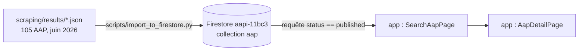

# Design

## Context

Voir proposal.md (Why). Trois briques existent et sont indépendantes :

Constats vérifiés dans le code le 2026-10-09 :
- Le script d'import mappe déjà `AapNormalized` vers le type `AAP`, utilise la signature comme
  identifiant (`scraped-<signature>`) et possède les options `--dry-run`, `--include-expired`,
  `--include-without-deadline`. Il n'a jamais été exécuté contre la base réelle.
- La page de recherche ne lit que les AAP `status == "published"`, triés par `publishedAt`.
  L'index composite nécessaire est déclaré dans `app/firestore.indexes.json` mais son
  déploiement effectif est inconnu.
- Les règles Firestore n'autorisent la lecture de `aap` qu'aux utilisateurs connectés dont
  `subscriptionStatus` vaut `active` ou `trial` ; l'inscription attribue `trial` pour 14 jours.
- Les cartes et la fiche calculent « jours restants » sans traiter le cas négatif.
- Poste : Node 22 et npm présents ; Firebase CLI absent ; `app/.env`, `app/node_modules` et
  `scripts/serviceAccountKey.json` absents.

## Goals / Non-Goals

**Goals :**
- Chaîne complète exécutée une fois pour de vrai, puis rejouable par Monsieur DUCOUT seul en
  suivant le README.
- Aucun secret manipulé par Claude Code : Monsieur DUCOUT dépose lui-même `app/.env` et la clé
  de compte de service.

**Non-Goals :**
- Pas de modification du schéma `AapNormalized` ni du type `AAP` (règle du projet).
- Pas de nouvelle requête Firestore : on reste sur la requête existante pour éviter un nouvel index.
- Pas de scraping.

## Decisions

### Décision 1 : projet Firebase réel plutôt que l'émulateur local

L'application est déjà configurée pour `aapi-11bc3` ; l'émulateur demanderait Firebase CLI, une
configuration supplémentaire et donnerait une démo moins proche du réel. Choix de Monsieur DUCOUT
le 2026-10-09. Repli si le projet n'est plus actif : émulateur (le code `firebase.ts` le prévoit
déjà via `VITE_USE_EMULATORS`).

### Décision 2 : les AAP clos sont importés avec le statut `published`

La page de recherche ne montre que `published`. Les importer en `closed` les rendrait invisibles
pour les porteurs, donc inutiles pour la démo. On garde `published` et on signale l'état par la
date : mention « Clôturé » calculée à l'affichage quand la clôture est passée. Alternative
écartée : ajouter un filtre « inclure les AAP clos » à la page, plus de code pour le même résultat.

### Décision 3 : mention « Clôturé » calculée côté affichage, sans nouveau champ

Un helper commun renvoie le nombre de jours restants ; les deux pages affichent « Clôturé » quand
il est négatif. Aucun champ ajouté au type `AAP`, aucune réécriture des documents : la règle reste
vraie pour les AAP saisis à la main.

### Décision 4 : index et règles déployés par Monsieur DUCOUT via Firebase CLI

`firebase deploy --only firestore:rules,firestore:indexes` nécessite une connexion Google
interactive que Claude Code ne peut pas faire. Installation : `npm install -g firebase-tools`.
Alternative si l'installation pose problème : créer l'index depuis le lien proposé par Firestore
dans la console du navigateur lors de la première requête en erreur.

### Décision 5 : compte porteur d'essai créé par Monsieur DUCOUT dans l'application

L'inscription normale attribue 14 jours d'essai, ce qui suffit pour lire la collection `aap`.
Claude Code ne crée aucun compte sur un service distant.

## Risks / Trade-offs

- [Projet `aapi-11bc3` désactivé ou facturation coupée] → tâche 1.1 : vérification dans la
  console avant tout le reste ; repli émulateur.
- [Index composite absent : la liste reste vide avec une erreur « index requis » dans la console
  du navigateur] → déploiement des index (décision 4) ; le message d'erreur contient le lien de
  création.
- [Règles Firestore déployées différentes de `firestore.rules`] → redéployer les règles avec les index.
- [Valeurs de secteur / territoire du mapping absentes des filtres de la page] → la liste reste
  visible sans filtre ; la vérification manuelle note les écarts pour un changement ultérieur.
- [Période d'essai de 14 jours expirée au moment d'une démo ultérieure] → passer
  `subscriptionStatus` à `active` dans la console pour le compte de démo.
