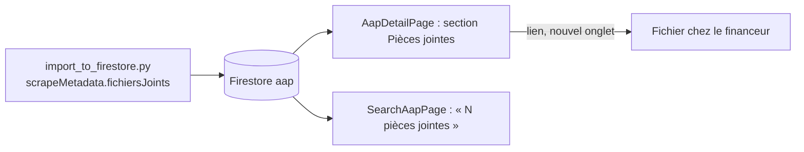

# Design

## Context

Voir proposal.md. Constats vérifiés dans le code le 2026-10-09 :
- L'import écrit pour chaque AAP scrapé un bloc `scrapeMetadata` contenant `fichiersJoints`
  (liste de `{ url, filename }`), mais le type `AAP` de l'application ne déclare pas ce bloc : le
  code TypeScript ne peut pas le lire sans contournement.
- La fiche a déjà une section « Documents requis » (`requiredDocuments`, liste de textes) construite
  avec `Card` et l'icône `FileText` : la nouvelle section suit le même gabarit.
- Les noms de fichiers scrapés sont techniques (`media_141918.pdf`) ; l'extension suffit pour
  indiquer le type de document.

## Goals / Non-Goals

**Goals :**
- Rendre visibles des données déjà en base, sans nouvelle requête ni nouvelle écriture.
- Code minimal, réutilisant le gabarit existant de la fiche.

**Non-Goals :**
- Pas de copie des fichiers dans Firebase Storage, pas d'aperçu.
- Pas de modification de l'import ni du schéma `AapNormalized`.

## Decisions

### Décision 1 : déclarer `scrapeMetadata` comme champ optionnel du type `AAP`

Exigé par la spec (lecture des pièces jointes). Ajout purement additif : `scrapeMetadata?: {
source: string; signature: string; fichiersJoints?: { url: string; filename: string }[] }`. Les
AAP saisis à la main n'ont pas ce champ et ne sont pas concernés. Alternative écartée : lire le
champ via `as any`, qui masquerait les erreurs de frappe.

### Décision 2 (révisée deux fois le 2026-10-09) : fichiers servis depuis le PC, Storage en réserve

Version finale : Vite distribue tout ce qui est dans `app/public/` ; un lien de jonction
`app/public/documents` -> `scraping/downloads` (créé par `mklink /J`, ignoré par Git) rend les
93 fichiers accessibles sous `http://localhost:3000/documents/<source>/<nom>`. Le script d'import
écrit `fichierLocal` (chemin relatif) quand le fichier existe ; la fiche n'utilise ce lien qu'en
mode développement (`import.meta.env.DEV`), donc jamais sur la version en ligne. Choix de
Monsieur DUCOUT : aucune facturation, objectif = tester le projet en local avant de déployer.
Limite acceptée : les documents ne sont visibles que quand l'application tourne sur son PC.

Version intermédiaire (code conservé, option `--vers-storage` du script) :

Première version : liens directs vers le site du financeur. Constat en validation : les ARS
répondent 403 « Forbidden » à tout accès direct (39 documents), seuls Fondation de France et CNSA
servent leurs fichiers. Les fichiers sont déjà sur le disque (`scraping/downloads/`, 117 Mo), donc :
- le script d'import les envoie dans Storage sous `uploads/aap-documents/<id du document AAP>/<nom>`,
  chemin déjà prévu par `storage.rules` (lecture : connecté + abonnement ou essai), et écrit le
  chemin dans `scrapeMetadata.fichiersJoints[].storagePath` ; envoi ignoré si le fichier est déjà
  présent (import rejouable) ;
- la fiche obtient l'adresse de téléchargement avec `getDownloadURL` du SDK client (déjà utilisé
  dans `aapService.uploadDocument`) et retombe sur l'URL d'origine si `storagePath` est absent.
Alternative écartée : rendre les fichiers publics (règle `allow read: if true`), plus simple mais
contraire au modèle d'accès par abonnement de la plateforme.
Attributs `rel="noopener noreferrer"` et `target="_blank"` comme le lien « Voir l'annonce
officielle » existant.

### Décision 3 : compteur sur la carte, sans liste

La carte de recherche reste compacte : une mention « N pièces jointes » à côté des informations
clés, affichée seulement si N > 0.

## Risks / Trade-offs

- [Fichier absent du disque pour un AAP donné] → lien d'origine conservé (peut répondre 403 chez
  les ARS) ; le lien « Voir l'annonce officielle » reste disponible sur la fiche.
- [Storage inaccessible : compte de facturation fermé, forfait Blaze exigé] → constaté ; envoi
  désactivé par défaut (`--vers-storage` pour l'activer plus tard), fichiers servis en local.
- [`fichiersJoints` absent ou vide sur certains documents] → la section et le compteur sont
  conditionnés à une liste non vide.
