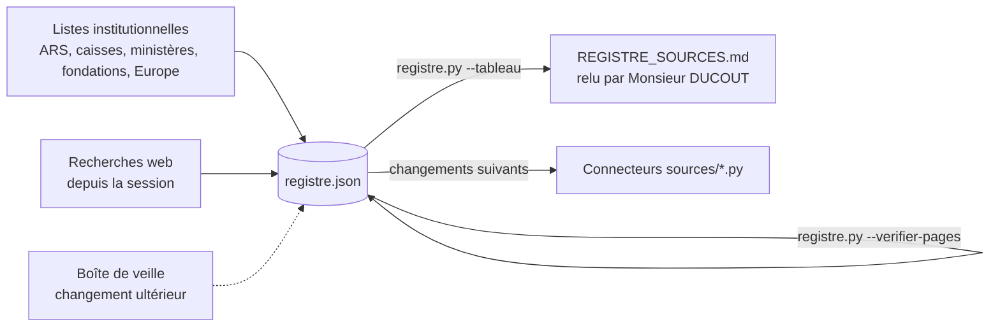

# Design

## Context

Voir proposal.md. Constats :
- `scraping/run.py --source <nom>` charge dynamiquement `sources/<nom>.py` ; il n'existe aucune
  liste des sources en dehors des fichiers présents. Les 17 ARS partagent le même système de site
  (ARS Corse est une copie quasi identique d'ARS Île-de-France).
- Monsieur DUCOUT veut d'abord savoir qui publie, puis prouver le scraping source par source, sans
  dépense API ; la mise à jour se fera sur un clic.
- Aucun moteur de recherche payant n'est disponible (crédits Brave, Serper et Tavily du projet
  Scrapling épuisés) ; les recherches web sont faites par Claude Code dans la session.

## Goals / Non-Goals

**Goals :**
- Un seul fichier de vérité, lisible par un programme (JSON) et une vue lisible par une personne
  (Markdown), régénérée à la demande.
- Zéro dépense ; outil autonome (bibliothèque standard + `httpx` déjà installé par le scraping).

**Non-Goals :**
- Pas de base de données ni d'interface : le registre vit dans le dépôt.
- Pas de découverte automatique continue.

## Decisions

### Décision 1 : JSON pour la vérité, Markdown généré pour la lecture

Un JSON est fiable à lire par les connecteurs et les tests ; un tableau Markdown est ce que
Monsieur DUCOUT relit (rendu par GitHub et par l'application Claude). Alternative écartée : Excel
comme source de vérité, plus naturel à éditer mais fragile (formats, doublons, pas de validation).
Les corrections de Monsieur DUCOUT sont reportées dans le JSON par Claude Code.

### Décision 2 : un outil `registre.py` séparé des quatre outils du POC

Règle du projet : un outil = une responsabilité (`run.py`, `validate.py`, `analyze_costs.py`,
`debug_page.py` ne sont pas fusionnés). `registre.py` porte trois commandes :
`--verifier-format`, `--verifier-pages`, `--tableau`.

### Décision 3 : contrôle des pages par simple requête HTTP, sans navigateur

Un `GET` avec en-tête navigateur suffit pour savoir si une page de listing existe. Les sites qui
refusent (403) sont listés « à revoir » : ce sera au connecteur, avec Playwright, de les traiter.
Délai d'une seconde entre deux requêtes, par politesse.

### Décision 4 : statut `operationnelle` réservé aux connecteurs validés visuellement

Conformément à la règle d'ajout d'une source (`run.py` puis `validate.py` puis contrôle visuel),
seules les 5 sources déjà validées reçoivent ce statut ; une source nouvelle ne dépasse pas
`page-verifiee` dans ce changement.

### Décision 5 : catégories fermées

Liste fixe (ars, ministere, caisse-nationale, agence-nationale, fondation, europe, collectivite,
societe-savante, etablissement, centrale-achat, autre) pour que le tableau reste trié et que le
format soit vérifiable. Les trois dernières ont été ajoutées le 2026-10-09 à la relecture de
Monsieur DUCOUT (sociétés savantes, hôpitaux et fondations hospitalières, centrales d'achat).

## Risks / Trade-offs

- [Liste incomplète malgré les recherches] → c'est attendu : le registre est vivant, les ajouts se
  font au fil de la veille ; le décompte par statut rend le manque visible.
- [Page de listing introuvable pour certaines sources (AAP publiés en PDF ou en actualités)] →
  `url_aap` pointe vers la page la plus proche (rubrique actualités, PDF récent) et la note le
  précise ; le connecteur futur tranchera.
- [Sites bloquant les requêtes simples (403)] → statut inchangé, listés « à revoir ».
